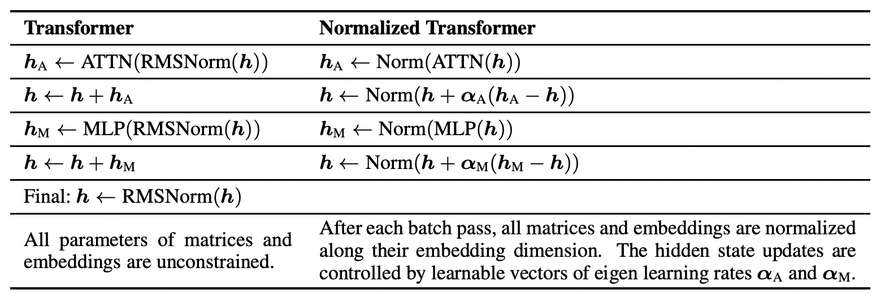

</img>

## nGPT (normalized GPT) - Pytorch

Quick implementation of <a href="https://arxiv.org/abs/2410.01131">nGPT</a>, learning entirely on the hypersphere, from NvidiaAI. The question is whether there is any loss of expressivity they swept under the rug, but I'll take it with good faith.

This type of network should also be studied in the context of continual learning and <a href="https://www.nature.com/articles/s41586-024-07711-7">loss of plasticity</a>

Adaptation to vision transformers is [here](https://github.com/lucidrains/vit-pytorch/blob/main/vit_pytorch/normalized_vit.py)

Update: The normalized feedforward was successfully applied for improving UTD for off-policy reinforcement learning [in a new paper](https://dojeon-ai.github.io/SimbaV2/)

## Install

```bash
$ pip install nGPT-pytorch
```

## Usage

```python
import torch
from nGPT_pytorch import nGPT

model = nGPT(
    num_tokens = 256,
    dim = 512,
    depth = 4,
    attn_norm_qk = True
)

x = torch.randint(0, 256, (2, 2048))

loss = model(x, return_loss = True)
loss.backward()

logits = model(x) # (2, 2048, 256)
```

## Test

Enwik8

```bash
$ python train.py
```

## Citations

```bibtex
@inproceedings{Loshchilov2024nGPTNT,
    title   = {nGPT: Normalized Transformer with Representation Learning on the Hypersphere},
    author  = {Ilya Loshchilov and Cheng-Ping Hsieh and Simeng Sun and Boris Ginsburg},
    year    = {2024},
    url     = {https://api.semanticscholar.org/CorpusID:273026160}
}
```

```bibtex
@article{Luo2017CosineNU,
    title     = {Cosine Normalization: Using Cosine Similarity Instead of Dot Product in Neural Networks},
    author    = {Chunjie Luo and Jianfeng Zhan and Lei Wang and Qiang Yang},
    journal   = {ArXiv},
    year      = {2017},
    volume    = {abs/1702.05870},
    url       = {https://api.semanticscholar.org/CorpusID:1505432}
}
```

```bibtex
@inproceedings{Zhou2024ValueRL,
    title   = {Value Residual Learning For Alleviating Attention Concentration In Transformers},
    author  = {Zhanchao Zhou and Tianyi Wu and Zhiyun Jiang and Zhenzhong Lan},
    year    = {2024},
    url     = {https://api.semanticscholar.org/CorpusID:273532030}
}
```
